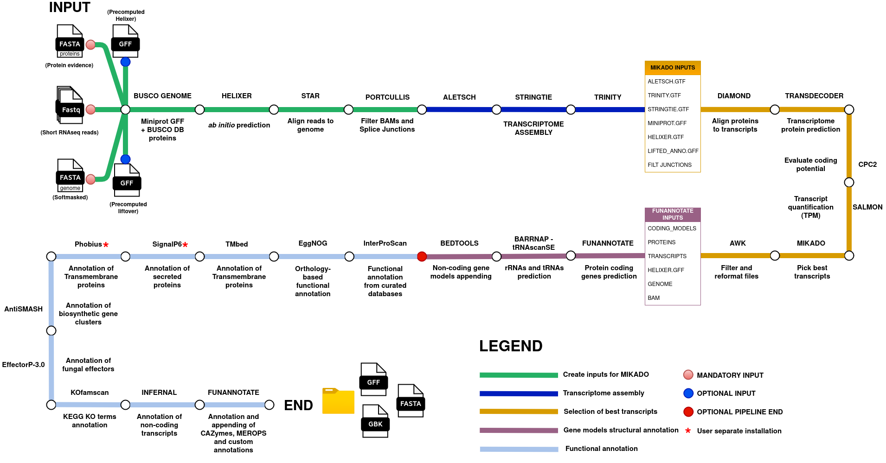

**bagRNA** is a user-friendly ncRNA-aware genome annotation pipeline for eukaryotic organisms. It is designed to predict, correct, classify and assign function to gene models, all in one go!

Take a look at all the steps !


The pipeline integrates:
- _ab initio_ prediction
- transcript alignment
- homology-based annotation

It identifies both **protein-coding** and **non-coding RNAs** (e.g., lncRNA, tRNA, rRNA), inferring biological function and incorporating this into the final annotation.

👤 Author
**Gabriele Rigano**

Bioinformatics and Computational Genomics LAB

University of Messina, Sicily, Italy

📧 gabrielerigano99@gmail.com

## 📌 Features

- **ncRNA-aware**: Retains and classifies non-coding features
- **All-in-one workflow**: From raw data to structural and functional annotation
- **Minimal inputs**: Genome FASTA, protein evidence, and RNA-seq reads
- **Modular & reproducible**: Uses Docker containers for tool management

## ⚙️ Pipeline Overview

1. Data preparation  
2. Transcriptome assembly  
3. Gene model selection & correction  
4. Structural annotation  
5. Functional annotation  

## 🚀 Installation

### 1. Clone the Repository

```bash
git clone https://github.com/BCGL-Unime/bagRNA.git
```

### 2. Set Up the Conda Environment

```bash
conda create -n bagRNA mamba -y
conda activate bagRNA
mamba install -f bagRNA.yaml
```
### 3. Download Docker Images

```bash
chmod +x download_docker_images.sh
bash download_docker_images.sh
```
## 🧩 Database Setup

```bash
chmod +x download_databases_bagRNA.sh
bash download_databases_bagRNA.sh
```

⚠️ Optional (But Recommended) Tools

The following must be downloaded manually due to licensing:

1) [GeneMark-ETP](https://github.com/gatech-genemark/GeneMark-ETP)  
2) [Phobius](https://software.sbc.su.se/phobius.html)  
3) [SignalP 6.0](https://services.healthtech.dtu.dk/services/SignalP-6.0/)  (Download the fast or slow-sequential models)

### Running the pipeline
## 🧪 Real Usage Example
```bash
bagRNA.sh \
  --mikado_config ../mikado_config.tsv --busco_lineage sordariomycetes \
  --Helixer_gff helixer_SS02.fasta.gff --input_fasta maskedSS02.fa \
  --locus_tag SS02 --Conditions ../mold_reads_for_STAR.tsv ../yeast_reads_for_STAR.tsv \
  --RAM_limit_Trinity 45G --limitBAMsortRAM 4571838164 \
  --orientation RF --strandedness secondstrand --databases /home/gab/databases_bagRNA/ \
  --max_intron_length 3000 --threads 12 --max_gene_length 30000 \
  --prot_evidence ../SSref_prot_and_evidence.faa --species "Sporothrix_schenckii" \
  --strain SS02 --codon_table 1 --scoring scerevisiae.yaml \
  --lifted_annotation lifted_ren_SS02.fasta.gff  \
  --submission_template /home/gab/tools/submission_template.sbt --no_tmbed \
  --GeneMark_PATH /home/gab/tools/GeneMark-ETP/ --jaccard_clip \
```
🗂 Required Inputs

| Argument                                  | Description                                             | Tips and specifics                                                                                                              |
| ----------------------------------------- | ------------------------------------------------------- | ------------------------------------------------------------------------------------------------------------------------------- |
| `--input_fasta`                           | Genome FASTA file (preferably softmasked)               | Run EarlGrey or EDTA TE prediction beforehand and get a softmasked assembly; remove mitochondrial/plastidial contigs            |
| `--prot_evidence`                         | Protein evidence in FASTA format                        | Download proteins of your taxon from UniProt                                                                                    |
| `--busco_lineage`                         | BUSCO lineage (e.g., `sordariomycetes`)                 | Use the phylogenetically lowest taxon possible                                                                                  |
| `--Conditions`                            | STAR manifest TSV file(s)                               | Check the example in the repository and the [docs](https://raw.githubusercontent.com/alexdobin/STAR/master/doc/STARmanual.pdf)  |
| `--mikado_config`                         | Mikado configuration YAML file                          | Check the example and [docs](https://mikado.readthedocs.io/en/stable/Tutorial/)                                                 |
| `--scoring`                               | Mikado scoring config (e.g., `scerevisiae.yaml`)        | Check the tutorial [here](https://mikado.readthedocs.io/en/stable/Tutorial/Scoring_tutorial/)                                   |
| `--submission_template`                   | `.sbt` file for GenBank submission                      | Check the example in the repository                                                                                             |
| `--species`                               | Species name in quotes (e.g., `"Arabidopsis_thaliana"`) | Must be written in quotes with underscores instead of spaces                                                                    |

🧠 Choose one of the two following options 

| Argument                                  | Description                                              | Tips and specifics                                                                        |
| ----------------------------------------- | -------------------------------------------------------- | ----------------------------------------------------------------------------------------  |
| `--helixer_lineage`                       | Choose among fungi, land_plant, vertebrate, invertebrate | Requires prior GPU and NVIDIA Container Toolkit configuration                             |
| `--Helixer_gff`                           | Use precomputed Helixer GFF                              | Run Helixer [here](https://www.plabipd.de/helixer_main.html) and provide the GFF as input |

📥 Optional Inputs

| Argument              | Description                             | Tips and specifics                                                                                                                             |
| --------------------- | --------------------------------------- | ---------------------------------------------------------------------------------------------------------------------------------------------- |
| `--lifted_annotation` | Liftoff/Lifton GFF annotation           | Lift a reference annotation to your genome assembly and provide it as evidence. [Lifton](https://github.com/Kuanhao-Chao/LiftOn) works well    |
| `--GeneMark_PATH`     | Path to GeneMarK-ET/ETP executable      | Provide the absolute path of your GeneMark installation where the "gmes_petap.pl" executable is located /home/bag/tools/GeneMark-ETP/          |
| `--databases`         | Path to functional annotation databases | Provide the absolute path to where you downloaded the databases with the script "download_databases_bagRNA.sh"                                 |

⚙️ Performance / Misc

| Argument              | Default        | Description                                | Tips and specifics                                                                                             |
| --------------------- | -------------- | ------------------------------------------ | -------------------------------------------------------------------------------------------------------------- |
| `--threads`, `-t`     | `1`            | Number of CPU threads                      | Number of CPU threads you want to use, try not to use them all, as your system may crash                       |
| `--jaccard_clip`      | *(on)*         | Enable for high gene density               | Use this flag if you are expecting high gene density with UTR overlap, recommended for fungi                   |
| `--max_gene_length`   | `30000`        | Max length of gene models                  | Check the longest gene in your organism or closely related and set around that length as cut-off               |
| `--RAM_limit_Trinity` | `45G`          | Max RAM for Trinity                        | Max RAM for Trinity transcript assembly                                                                        |
| `--limitBAMsortRAM`   | `4571838164`   | STAR BAM sort RAM limit                    | Max RAM for STAR BAM sorting                                                                                   |
| `--orientation`       | `RF`           | Read orientation (`FR`, `RF`, etc.)        | Check this [tutorial](https://chipster.csc.fi/manual/library-type-summary.html) for understanding strandedness |
| `--strandedness`      | `secondstrand` | Strand type (e.g., `secondstrand`)         | Check this [tutorial](https://chipster.csc.fi/manual/library-type-summary.html) for understanding strandedness |
| `--max_intron_length` | `3000`         | Max intron size                            | Check the longest intron in your organism or closely related and set around that length as cut-off             |
| `--codon_table`       | `1`            | NCBI codon table ID                        | Check the codon tables [here](https://www.ncbi.nlm.nih.gov/Taxonomy/Utils/wprintgc.cgi)                        |
| `--strain`            | `strain`       | Strain/isolate name                        | Assign a strain or isolate name                                                                                |
| `--locus_tag`         | `bagRNA`       | Locus tag prefix                           | Locus tag prefix, [here](https://www.ddbj.nig.ac.jp/ddbj/locus_tag-e.html) the specifications                  |

🔌 Disable Specific Modules

| Argument               | Description                | Tips and specifics                                                                                               |
| ---------------------- | -------------------------- | ---------------------------------------------------------------------------------------------------------------- |
| `--no_functional_anno` | Skip functional annotation | Skips InterProScan  EggNOG  KOfamscan, Infernal, Signalp6, Phobius, Tmbed, AntiSMASH                             |
| `--no_antismash`       | Skip AntiSMASH             | Skips Secondary Metabolite clusters prediction (fungi only)                                                      |
| `--no_tmbed`           | Skip Tmbed                 | Tmbed is very fast on GPU but very slow on CPU, use this flag if your machine does not have a performing GPU     |

How to Cite
Work in progress...
