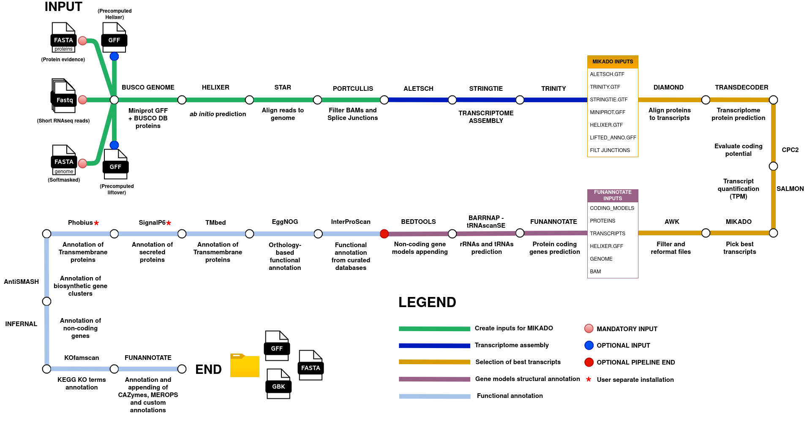

# 🧬 bagRNA

**bagRNA** is an ncRNA-aware genome annotation pipeline for eukaryotic organisms. It is designed to produce comprehensive, functionally annotated GFF3 files — even for users without extensive bioinformatics expertise.



The pipeline integrates:
- _ab initio_ prediction
- transcript alignment
- homology-based annotation

It identifies both **protein-coding** and **non-coding RNAs** (e.g., lncRNA, tRNA, rRNA), inferring biological function and incorporating this into the final annotation.

## 📌 Features

- **ncRNA-aware**: Retains and classifies non-coding features
- **All-in-one workflow**: From raw data to structural and functional annotation
- **Minimal inputs**: Genome FASTA, protein evidence, and RNA-seq reads
- **Modular & reproducible**: Uses Docker containers for tool management

## ⚙️ Pipeline Overview

1. Data preparation  
2. Transcriptome assembly  
3. Gene model selection & correction  
4. Structural annotation  
5. Functional annotation  

## 🚀 Installation

### 1. Clone the Repository

```bash
git clone https://github.com/BCGL-Unime/bagRNA.git
```

### 2. Set Up the Conda Environment

```bash
conda create -n bagRNA mamba -y
conda activate bagRNA
mamba install -f bagRNA.yaml
```
### 3. Download Docker Images

```bash
chmod +x download_docker_images.sh
bash download_docker_images.sh
```
## 🧩 Database Setup

```bash
chmod +x download_databases_bagRNA.sh
bash download_databases_bagRNA.sh
```

⚠️ Optional (But Recommended) Tools

The following must be downloaded manually due to licensing:

1) GeneMark-ETP https://github.com/gatech-genemark/GeneMark-ETP

2) Phobius https://software.sbc.su.se/phobius.html

3) SignalP 6.0 https://services.healthtech.dtu.dk/services/SignalP-6.0/  (Download the fast or slow-sequential models)

### Running the pipeline

bagRNA arguments

🗂 Required Inputs

| Argument                | Description                                             | Tips                                                                            | 
| ----------------------- | ------------------------------------------------------- | ------------------------------------------------------------------------------- |  
| `--input_fasta`         | Genome FASTA file (preferably softmasked)               | Run EarlGrey or EDTA TE prediction beforehand                                   |
| `--prot_evidence`       | Protein evidence in FASTA format                        | Download proteins of your taxon from UniProt                                    |                               
| `--busco_lineage`       | BUSCO lineage (e.g., `sordariomycetes`)                 | Use the phylogenetically lowest taxon possible                                  |
| `--Conditions`          | STAR manifest TSV file(s)                               | Check the example in the repository                                             |  
| `--mikado_config`       | Mikado configuration YAML file                          | Check the example and [docs](https://mikado.readthedocs.io/en/stable/Tutorial/) |
| `--scoring`             | Mikado scoring config (e.g., `scerevisiae.yaml`)        |                                                                                 |
| `--species`             | Species name in quotes (e.g., `"Arabidopsis_thaliana"`) |                                                                                 |
| `--submission_template` | `.sbt` file for GenBank submission                      |                                                                                 |

🧠 Choose one of the two following options 

| Argument            | Description                 |
| ------------------- | --------------------------- |
| `--helixer_lineage` | Run Helixer (GPU required)  |
| `--Helixer_gff`     | Use precomputed Helixer GFF |

📥 Optional Inputs

| Argument              | Description                             |
| --------------------- | --------------------------------------- |
| `--lifted_annotation` | Liftoff/Lifton GFF annotation           |
| `--GeneMark_PATH`     | Path to GeneMark executable             |
| `--databases`         | Path to functional annotation databases |

⚙️ Performance / Misc

| Argument              | Default    | Description                                |
| --------------------- | ---------- | ------------------------------------------ |
| `--threads`, `-t`     | `20`       | Number of CPU threads                      |
| `--jaccard_clip`      | *(on)*     | Enable for high gene density (e.g., fungi) |
| `--max_gene_length`   | -          | Max length of gene models                  |
| `--RAM_limit_Trinity` | `45G`      | RAM for Trinity                            |
| `--limitBAMsortRAM`   | -          | STAR BAM sort RAM limit                    |
| `--orientation`       | -          | Read orientation (`FR`, `RF`, etc.)        |
| `--strandedness`      | -          | Strand type (e.g., `secondstrand`)         |
| `--max_intron_length` | `3000`     | Max intron size                            |
| `--codon_table`       | `1`        | NCBI codon table ID                        |
| `--strain`            | `"strain"` | Strain/isolate name                        |
| `--locus_tag`         | `"bagRNA"` | Locus tag prefix                           |

🔌 Disable Specific Modules

| Argument               | Description                |
| ---------------------- | -------------------------- |
| `--no_functional_anno` | Skip functional annotation |
| `--no_antismash`       | Skip AntiSMASH             |
| `--no_tmbed`           | Skip Tmbed                 |


👤 Author

Gabriele Rigano

Bioinformatics and Computational Genomics LAB

University of Messina,Sicily,Italy

📧 gabrielerigano99@gmail.com

Citing
Work in progress...
